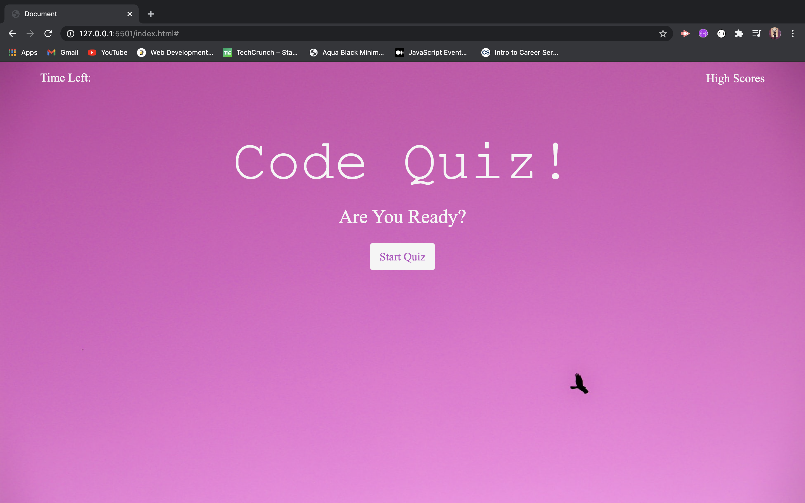

# Code-Quiz-HW-4

This week’s homework required to create a simple calendar application that allows a user to save events for each hour of the day by modifying starter code. This app will run in the browser and feature dynamically updated HTML and CSS powered by jQuery.

* I chose [Day.js](https://day.js.org/) as my library.

## Purpose: ##

AS A coding boot camp student 
I WANT to take a timed quiz on JavaScript fundamentals that stores high scores 
SO THAT I can gauge my progress compared to my peers 

## Criteria Includes: ##

GIVEN I am taking a code quiz
* WHEN I click the start button
* THEN a timer starts and I am presented with a question
* WHEN I answer a question
* THEN I am presented with another question
* WHEN I answer a question incorrectly
* THEN time is subtracted from the clock
* WHEN all questions are answered or the timer reaches 0
* THEN the game is over
* WHEN the game is over
* THEN I can save my initials and score

  
  ## Image of Work Day Scheduler: ##
  
  
  
  
 ## Languages Used: ##
  
      HTML, CSS, Bootstrap, JavaScript,  
      
 ## Deployed Sites ##
* [Github Repo]()
* [Deployed Link]()
